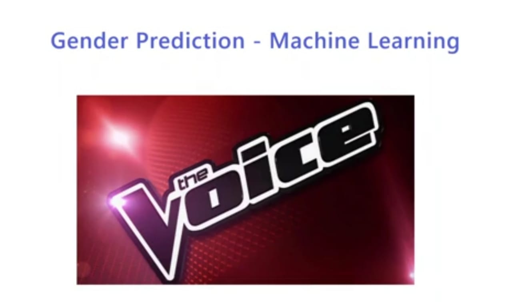

  
 

<h3> link - https://voice-gender-predictn-app.herokuapp.com/Voice/</h3>

 <i> <h2> What are we doing?</h2>

<h3><i>Actually we have a dataset containing attributes related to voice and through that we are training a model that can predict if the voice belongs to female or a male In this project, before even starting coding, you have to understand about the data. The data is showcasing the physical attributes of voice through which we are making our predictions. </h2>

 

<h2> Details of the Project

<h3> The Project is divided into three parts
<h3>1- Building a Deep learning model to predict customer purchase completion
<h3>2. We build a web app on Django to mount the prediction model. 
<h3>3. We deploy the Django project on Heroku through github.

     
  
 
<h2>Deep Learning Model

<h3> So we start off with building two machine learning model, a SVC and RandomForest Classifier model and train those models using the voice datapoints </h3>
    
  
  <h2>Deploying on Heroku

<h3> This is the last part of the course where we will deploy the Django application on Heroku using the connections to github. </h3>
    

 

     
  
  <h1> Screenshots </h1>
  <h2> Input Screen </h2>
 
   
  
    
  
<h2> Output Screen </h2> 

   
  
    

### Give It a Star if you liked the project 
